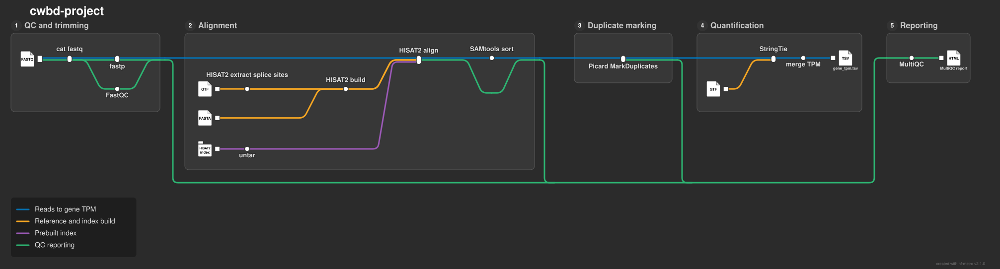

# SaveTheWhaIes/cwbd-project

[](https://github.com/SaveTheWhaIes/cwbd-project/actions/workflows/nf-test.yml)
[](https://github.com/SaveTheWhaIes/cwbd-project/actions/workflows/linting.yml)
[](https://www.nf-test.com)

[](https://www.nextflow.io/)
[](https://github.com/nf-core/tools/releases/tag/4.1.0)
[](https://docs.conda.io/en/latest/)
[](https://www.docker.com/)
[](https://sylabs.io/docs/)
[](https://cloud.seqera.io/launch?pipeline=https://github.com/SaveTheWhaIes/cwbd-project)

## Introduction

**SaveTheWhaIes/cwbd-project** is a Nextflow pipeline for bulk RNA-seq. It takes short reads (single or paired end) together with a genome and its gene annotation, aligns the reads splice aware, marks duplicates and quantifies the expression of every annotated gene. The result is one table with the TPM of each gene in each sample, plus a MultiQC report that collects the QC of all steps.

It was written as the project of the Computational Workflows for Biomedical Data course and is built on the [nf-core](https://nf-co.re) template.



1. Merge re-sequenced FASTQ files of the same sample ([`cat`](https://www.gnu.org/software/coreutils/manual/html_node/cat-invocation.html))
2. Raw read QC ([`FastQC`](https://www.bioinformatics.babraham.ac.uk/projects/fastqc/))
3. Adapter and quality trimming ([`fastp`](https://github.com/OpenGene/fastp))
4. Splice aware alignment to the genome ([`HISAT2`](https://daehwankimlab.github.io/hisat2/)), building the index first if none is given
5. Sort and index alignments ([`SAMtools`](https://www.htslib.org/))
6. Duplicate read marking, without removing them ([`Picard MarkDuplicates`](https://broadinstitute.github.io/picard/))
7. Gene level quantification of the annotated transcripts ([`StringTie`](https://ccb.jhu.edu/software/stringtie/))
8. Merge the gene TPM values of all samples into one table (`bin/merge_tpm.py`)
9. Present QC for all steps ([`MultiQC`](http://multiqc.info/))

## Usage

> [!NOTE]
> If you are new to Nextflow and nf-core, please refer to [this page](https://nf-co.re/docs/get_started/environment_setup/overview) on how to set-up Nextflow. Make sure to [test your setup](https://nf-co.re/docs/get_started/run-your-first-pipeline) with `-profile test` before running the workflow on actual data.

First, prepare a samplesheet with your input data that looks as follows:

`samplesheet.csv`:

```csv
sample,fastq_1,fastq_2,strandedness
CONTROL_REP1,AEG588A1_S1_L002_R1_001.fastq.gz,AEG588A1_S1_L002_R2_001.fastq.gz,reverse
TREATMENT_REP1,AEG588A4_S4_L003_R1_001.fastq.gz,,reverse
```

Each row represents a fastq file (single end) or a pair of fastq files (paired end). Rows with the same sample name are treated as several runs of one sample and concatenated. `strandedness` is one of `forward`, `reverse` or `unstranded`; the pipeline does not infer it, see the [usage documentation](docs/usage.md#finding-out-the-strandedness) on how to find it out.

Now, you can run the pipeline using:

```bash
nextflow run SaveTheWhaIes/cwbd-project \
   -profile <docker/singularity/.../institute> \
   --input samplesheet.csv \
   --fasta genome.fa \
   --gtf genes.gtf \
   --hisat2_index hisat2/ \
   --outdir <OUTDIR>
```

`--hisat2_index` is optional. Without it the index is built from `--fasta` and `--gtf`, which only makes sense for small genomes. To try the pipeline on test data first:

```bash
nextflow run SaveTheWhaIes/cwbd-project -profile test,docker --outdir results_test
```

> [!WARNING]
> Please provide pipeline parameters via the CLI or Nextflow `-params-file` option. Custom config files including those provided by the `-c` Nextflow option can be used to provide any configuration _**except for parameters**_; see [docs](https://nf-co.re/docs/running/run-pipelines#using-parameter-files).

For more details, see the [usage documentation](docs/usage.md).

## Pipeline output

The main result is `<OUTDIR>/tpm/gene_tpm.tsv` with one row per gene and one TPM column per sample. Next to it the pipeline writes the FastQC and fastp reports, the HISAT2 alignment logs, the duplicate marked BAM files with their Picard metrics, the per sample StringTie output and the MultiQC report. All files are described in the [output documentation](docs/output.md).

## Credits

SaveTheWhaIes/cwbd-project was originally written by Laurens Hahn and Miriam Beermann.

## Contributions and Support

If you would like to contribute to this pipeline, please see the [contributing guidelines](docs/CONTRIBUTING.md).

## Citations

An extensive list of references for the tools used by the pipeline can be found in the [`CITATIONS.md`](CITATIONS.md) file.

This pipeline uses code and infrastructure developed and maintained by the [nf-core](https://nf-co.re) community, reused here under the [MIT license](https://github.com/nf-core/tools/blob/main/LICENSE).

> **The nf-core framework for community-curated bioinformatics pipelines.**
>
> Philip Ewels, Alexander Peltzer, Sven Fillinger, Harshil Patel, Johannes Alneberg, Andreas Wilm, Maxime Ulysse Garcia, Paolo Di Tommaso & Sven Nahnsen.
>
> _Nat Biotechnol._ 2020 Feb 13. doi: [10.1038/s41587-020-0439-x](https://dx.doi.org/10.1038/s41587-020-0439-x).
